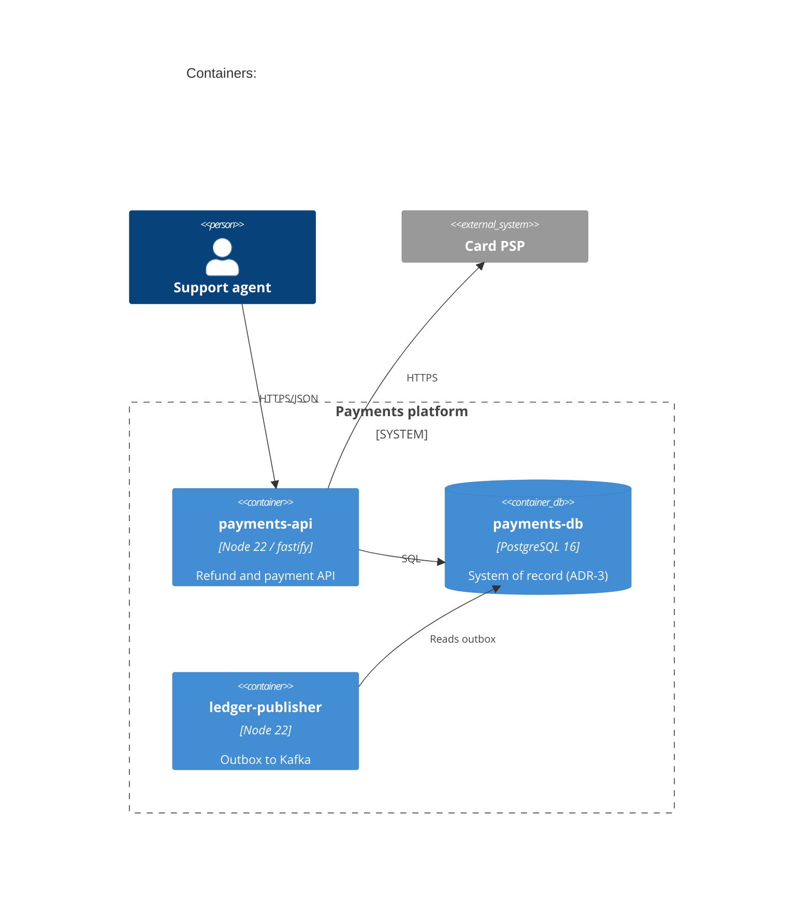

# C4 level 2: containers

<!-- Container names MUST match service-map.yaml. Every relationship that crosses a trust boundary
     needs STRIDE rows in threat-model.yaml. -->

```mermaid
C4Container
  title Containers: <system>
  Person(agent, "Support agent")
  System_Boundary(b, "Payments platform") {
    Container(api, "payments-api", "Node 22 / fastify", "Refund and payment API")
    ContainerDb(db, "payments-db", "PostgreSQL 16", "System of record (ADR-3)")
    Container(worker, "ledger-publisher", "Node 22", "Outbox to Kafka")
  }
  System_Ext(psp, "Card PSP")
  Rel(agent, api, "HTTPS/JSON")
  Rel(api, db, "SQL")
  Rel(api, psp, "HTTPS")
  Rel(worker, db, "Reads outbox")
```
