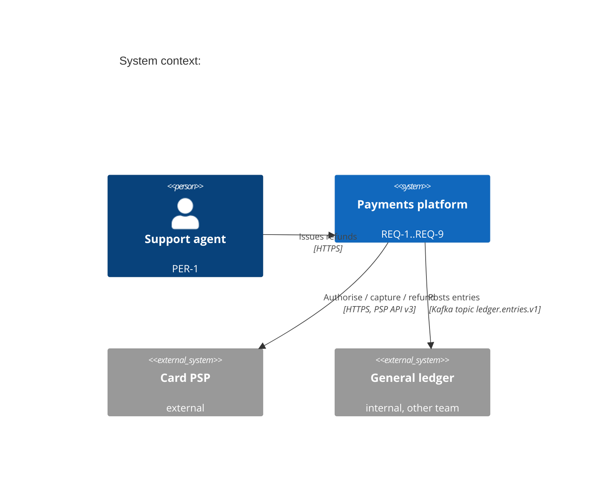

# C4 level 1: system context

```mermaid
C4Context
  title System context: <system>
  Person(agent, "Support agent", "PER-1")
  System(payments, "Payments platform", "REQ-1..REQ-9")
  System_Ext(psp, "Card PSP", "external")
  System_Ext(ledger, "General ledger", "internal, other team")
  Rel(agent, payments, "Issues refunds", "HTTPS")
  Rel(payments, psp, "Authorise / capture / refund", "HTTPS, PSP API v3")
  Rel(payments, ledger, "Posts entries", "Kafka topic ledger.entries.v1")
```

| Element | Source |
|---|---|
| Support agent | `plans/intake/personas.yaml#PER-1` |
| Card PSP | `doc:payments-brd@<hash>#integrations/psp` |
