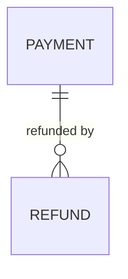

# Data model

<!-- Entities come from plans/intake/glossary.yaml. Each entity has exactly ONE owning service. -->

| Entity | Owning service | Key attributes | Classification | Retention | Residency | Source |
|---|---|---|---|---|---|---|
| Refund | payments-api | amount, currency, reason, captured_payment_id | CONFIDENTIAL | 7 years (CON-2) | EU (CON-3) | glossary.yaml#Refund |

